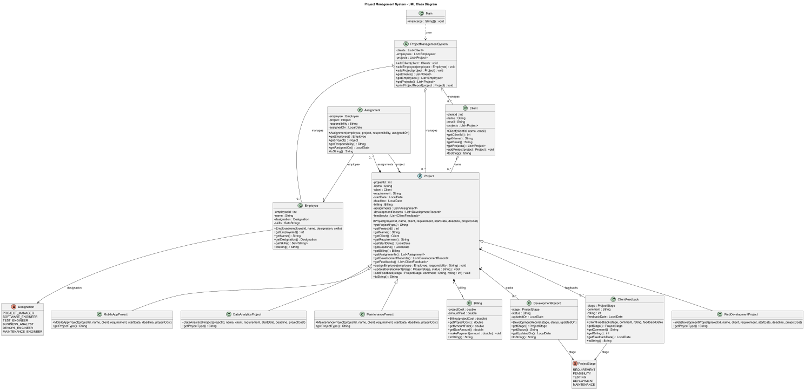
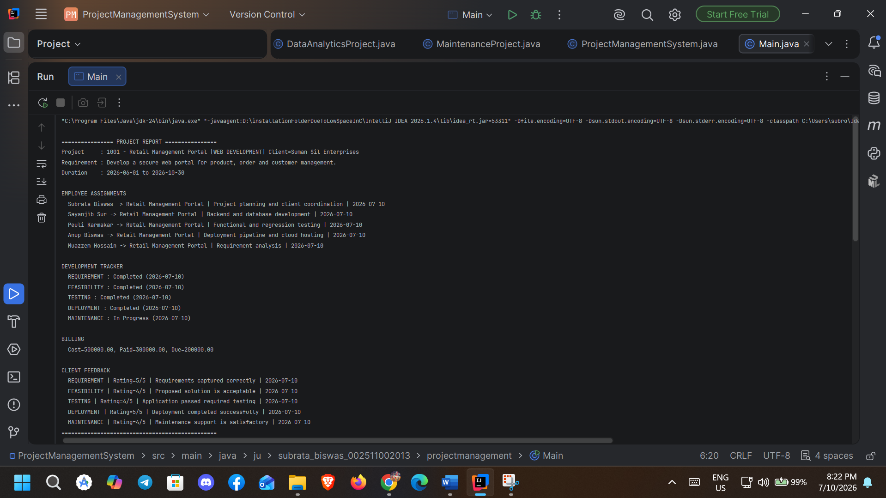
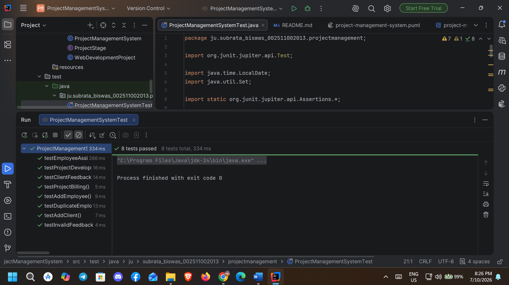

# Project Management System

## Brief Introduction

The Project Management System is an object-oriented Java application designed to manage multiple clients, projects, employees, project development stages, billing, and client feedback.

A company may handle multiple projects for different clients. Specific employees are assigned to particular projects according to their designation and skills. The system also tracks the complete project development lifecycle and maintains billing and client feedback information.

The project is implemented using Java and follows Object-Oriented Programming concepts such as inheritance, abstraction, encapsulation, association, aggregation, and composition.

## Objective

The main objectives of the Project Management System are:

- To manage multiple clients and their projects.
- To assign specific employees to particular projects.
- To maintain employee designation and skills.
- To store project requirements as general text.
- To track the project development lifecycle.
- To manage project billing and payment information.
- To collect client feedback at different project stages.
- To demonstrate Object-Oriented Programming concepts using Java.
- To represent the complete system using a UML class diagram.
- To verify the system functionality using JUnit test cases.

## Project Development Lifecycle

The system tracks the following project stages:

1. Requirement
2. Feasibility
3. Testing
4. Deployment
5. Maintenance

Client feedback can be recorded at each project development stage.

## Object-Oriented Design

`Project` is the abstract superclass of the system.

The project subclasses are:

- `WebDevelopmentProject`
- `MobileAppProject`
- `DataAnalyticsProject`
- `MaintenanceProject`

Other major classes are:

- `Employee`
- `Client`
- `Assignment`
- `Billing`
- `DevelopmentRecord`
- `ClientFeedback`
- `ProjectManagementSystem`
- `Main`

The system also uses the following enums:

- `Designation`
- `ProjectStage`

## UML Class Diagram

The complete UML class diagram of the Project Management System is shown below.



The PlantUML source file is available at:

`docs/project-management-system.puml`

## Features

- Multiple client management
- Multiple project management
- Employee management
- Employee designation and skill management
- Employee-to-project assignment
- Project requirement management
- Project development lifecycle tracking
- Project billing and payment tracking
- Client feedback at each project stage
- Different project types using inheritance
- Complete project report generation

## Technologies Used

- Java
- Oracle JDK 24
- Maven
- JUnit 5
- PlantUML
- IntelliJ IDEA

## Project Structure

```text
ProjectManagementSystem
|
|-- docs
|   |-- screenshots
|   |   |-- project-output.png
|   |   `-- test-result.png
|   |
|   |-- project-management-system.puml
|   `-- project-management-system-uml.png
|
|-- src
|   |-- main
|   |   `-- java
|   |       `-- ju.subrata_biswas_002511002013.projectmanagement
|   |           |-- Assignment.java
|   |           |-- Billing.java
|   |           |-- Client.java
|   |           |-- ClientFeedback.java
|   |           |-- DataAnalyticsProject.java
|   |           |-- Designation.java
|   |           |-- DevelopmentRecord.java
|   |           |-- Employee.java
|   |           |-- Main.java
|   |           |-- MaintenanceProject.java
|   |           |-- MobileAppProject.java
|   |           |-- Project.java
|   |           |-- ProjectManagementSystem.java
|   |           |-- ProjectStage.java
|   |           `-- WebDevelopmentProject.java
|   |
|   `-- test
|       `-- java
|           `-- ju.subrata_biswas_002511002013.projectmanagement
|               `-- ProjectManagementSystemTest.java
|
|-- pom.xml
`-- README.md
```

## Test Cases

The project contains 8 JUnit test cases.

The test cases verify:

- Adding a client
- Adding an employee
- Employee assignment to a project
- Project development tracking
- Project billing
- Client feedback
- Duplicate employee assignment validation
- Invalid client feedback rating validation

### Test Result

All test cases passed successfully.

```text
8 tests passed
8 tests total
Process finished with exit code 0
```

## Output Screenshots

### Project Report Output

The following screenshot shows the generated project report containing employee assignments, the project development lifecycle, billing information, and client feedback.



### JUnit Test Result

The following screenshot shows the successful execution of all JUnit test cases.



## Sample Output

```text
================ PROJECT REPORT ================
Project     : 1001 - Retail Management Portal [WEB DEVELOPMENT] Client=Suman Sil Enterprises
Requirement : Develop a secure web portal for product, order and customer management.
Duration    : 2026-06-01 to 2026-10-30

EMPLOYEE ASSIGNMENTS
Subrata Biswas -> Retail Management Portal | Project planning and client coordination
Sayanjib Sur -> Retail Management Portal | Backend and database development
Peuli Karmakar -> Retail Management Portal | Functional and regression testing
Anup Biswas -> Retail Management Portal | Deployment pipeline and cloud hosting
Muazzem Hossain -> Retail Management Portal | Requirement analysis

DEVELOPMENT TRACKER
REQUIREMENT : Completed
FEASIBILITY : Completed
TESTING : Completed
DEPLOYMENT : Completed
MAINTENANCE : In Progress

BILLING
Cost=500000.00, Paid=300000.00, Due=200000.00

CLIENT FEEDBACK
REQUIREMENT | Rating=5/5 | Requirements captured correctly
FEASIBILITY | Rating=4/5 | Proposed solution is acceptable
TESTING | Rating=4/5 | Application passed required testing
DEPLOYMENT | Rating=5/5 | Deployment completed successfully
MAINTENANCE | Rating=4/5 | Maintenance support is satisfactory
================================================
```

## How to Run

1. Clone the repository.
2. Open the project in IntelliJ IDEA.
3. Make sure Oracle JDK 24 is configured.
4. Reload the Maven project.
5. Open `Main.java`.
6. Run the `main()` method.

## How to Run Test Cases

1. Open `ProjectManagementSystemTest.java`.
2. Run `ProjectManagementSystemTest`.
3. Verify that all 8 test cases pass.

## Author

**Subrata Biswas**

M.E. Information Technology  
Jadavpur University

Class Roll: 002511002013

## Assignment

M.E. UML Lab Assignment  
Project Management System  
2026